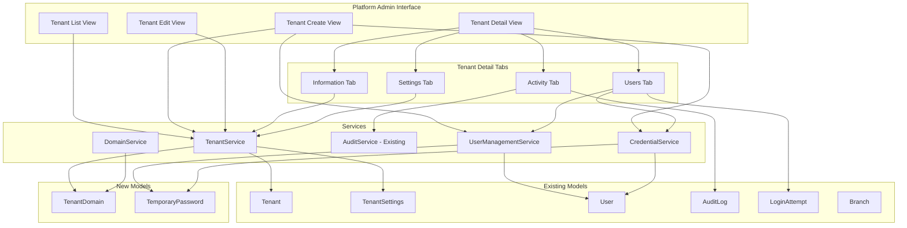
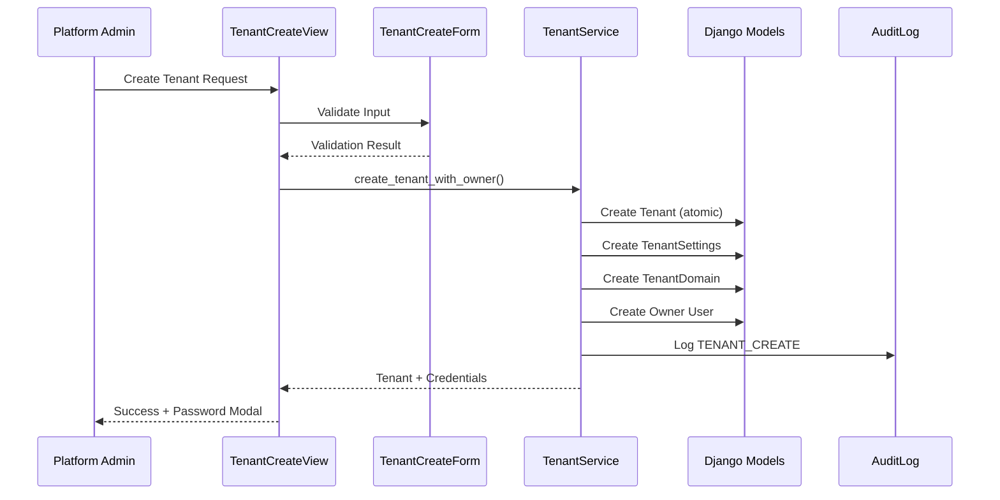

# Design Document: Advanced Tenant Management

## Overview

This design document describes the architecture and implementation approach for enhancing the Tenant Management System in the Jewelry Shop SaaS Platform. The enhancements focus on expanding the tenant creation/edit forms, implementing comprehensive user management, adding activity logging, and providing enterprise-grade administration features within the Tenants tab.

The implementation builds upon existing models and views in `apps/core/`:
- **Models**: `Tenant`, `TenantSettings`, `User`, `Branch`, `AuditLog`, `LoginAttempt`
- **Views**: `TenantListView`, `TenantDetailView`, `TenantCreateView`, `TenantUpdateView`

**Critical**: This system uses PostgreSQL Row-Level Security (RLS) for tenant data isolation. All queries must include tenant filtering.

## Architecture

### High-Level Architecture



### Data Flow for Tenant Creation



## Components and Interfaces

### 1. Enhanced Forms

#### TenantCreateForm (Enhanced)
Location: `apps/core/forms.py`

```python
class TenantCreateForm(forms.Form):
    # Basic Info Section
    company_name: CharField  # Required, min 2 chars
    slug: SlugField  # Optional, auto-generated from company_name
    status: ChoiceField  # Default: ACTIVE
    
    # Business Settings Section (maps to TenantSettings)
    business_name: CharField  # Optional
    business_registration_number: CharField  # Optional
    tax_identification_number: CharField  # Optional
    address_line_1: CharField  # Optional
    address_line_2: CharField  # Optional
    city: CharField  # Optional
    state_province: CharField  # Optional
    postal_code: CharField  # Optional
    country: CharField  # Optional
    phone: CharField  # Optional
    fax: CharField  # Optional
    email: EmailField  # Required for business contact
    website: URLField  # Optional
    
    # Localization Section (maps to TenantSettings)
    timezone: ChoiceField  # From pytz.common_timezones
    currency: ChoiceField  # From TenantSettings.CURRENCY_CHOICES
    date_format: ChoiceField  # From TenantSettings.DATE_FORMAT_CHOICES
    
    # Domain Section (creates TenantDomain)
    subdomain: CharField  # Auto-generated from slug
    custom_domain: CharField  # Optional
    
    # Initial Admin User Section (creates User)
    admin_username: CharField  # Required, unique
    admin_email: EmailField  # Required
    admin_password: CharField  # Required, validated for strength
    admin_password_confirm: CharField  # Must match admin_password
    admin_phone: CharField  # Optional
```


#### TenantUserCreateForm
Location: `apps/core/forms.py`

```python
class TenantUserCreateForm(forms.Form):
    username: CharField  # Required, unique within tenant
    email: EmailField  # Required
    password: CharField  # Required, validated for strength
    password_confirm: CharField  # Must match password
    role: ChoiceField  # TENANT_OWNER, TENANT_MANAGER, TENANT_EMPLOYEE
    branch: ModelChoiceField  # Optional, filtered by tenant
    phone: CharField  # Optional
    language: ChoiceField  # From User.LANGUAGE_CHOICES
    theme: ChoiceField  # From User.THEME_CHOICES
    force_mfa: BooleanField  # Optional, default False
```

### 2. Service Layer

Location: `apps/core/services/tenant_service.py`

#### TenantService
```python
class TenantService:
    @transaction.atomic
    def create_tenant_with_owner(
        self,
        tenant_data: dict,
        settings_data: dict,
        owner_data: dict,
        domain_data: dict,
        created_by: User
    ) -> tuple[Tenant, User, str]:
        """
        Creates tenant, settings, domain, and owner user atomically.
        Returns (tenant, owner_user, initial_password)
        
        Steps:
        1. Create Tenant with tenant_data
        2. Create TenantSettings linked to tenant
        3. Create TenantDomain (subdomain) linked to tenant
        4. Create User with role=TENANT_OWNER linked to tenant
        5. Log TENANT_CREATE in AuditLog
        """
        
    @transaction.atomic
    def update_tenant(
        self,
        tenant: Tenant,
        tenant_data: dict,
        settings_data: dict,
        domain_data: dict,
        modified_by: User
    ) -> Tenant:
        """
        Updates tenant and related settings with audit logging.
        Captures old_values and new_values for AuditLog.
        """
        
    def get_tenant_statistics(self, tenant: Tenant) -> dict:
        """
        Returns statistics for Information tab:
        - user_count, active_users, inactive_users, users_by_role
        - branch_count, branch_names
        - storage_used_bytes, storage_percentage
        - last_activity_timestamp, last_active_user
        """
        
    @transaction.atomic
    def bulk_change_status(
        self,
        tenant_ids: list[UUID],
        new_status: str,
        reason: str,
        modified_by: User
    ) -> int:
        """
        Bulk status change with audit logging.
        Returns count of changed tenants.
        Logs each change in AuditLog.
        """
```

#### UserManagementService
Location: `apps/core/services/user_service.py`

```python
class UserManagementService:
    @transaction.atomic
    def create_tenant_user(
        self,
        tenant: Tenant,
        user_data: dict,
        created_by: User
    ) -> tuple[User, str]:
        """
        Creates user for tenant.
        Returns (user, initial_password)
        Logs USER_CREATE in AuditLog.
        """
        
    @transaction.atomic
    def update_tenant_user(
        self,
        user: User,
        user_data: dict,
        modified_by: User
    ) -> User:
        """
        Updates user with audit logging.
        Captures changed fields in AuditLog.
        """
        
    def generate_temporary_password(
        self,
        user: User,
        expiry_hours: int,
        generated_by: User
    ) -> str:
        """
        Creates TemporaryPassword record with expiry.
        Returns plaintext password (one-time display).
        Logs action in AuditLog.
        """
        
    def get_login_history(
        self,
        user: User,
        limit: int = 10
    ) -> QuerySet[LoginAttempt]:
        """
        Returns recent login attempts from LoginAttempt model.
        Filtered by user, ordered by -timestamp.
        """
        
    def get_failed_login_count_24h(self, user: User) -> int:
        """
        Returns count of failed logins in last 24 hours.
        Uses LoginAttempt model with result != SUCCESS.
        """
        
    def can_deactivate_user(self, user: User) -> tuple[bool, str]:
        """
        Checks if user can be deactivated.
        Returns (False, "Cannot deactivate last owner") if last TENANT_OWNER.
        """
```


#### CredentialService
Location: `apps/core/services/credential_service.py`

```python
class CredentialService:
    def generate_secure_password(self, length: int = 16) -> str:
        """
        Generates a secure random password meeting requirements:
        - Min 8 chars, 1 uppercase, 1 lowercase, 1 number, 1 special char
        """
        
    def validate_password_strength(self, password: str) -> tuple[bool, list[str]]:
        """
        Validates password meets requirements.
        Returns (valid, list_of_errors).
        Uses Django's password validators.
        """
        
    def hash_password(self, password: str) -> str:
        """Hashes password using Django's make_password."""
        
    def create_password_reset_token(self, user: User) -> str:
        """
        Creates password reset token using Django's PasswordResetTokenGenerator.
        """
```

#### DomainService
Location: `apps/core/services/domain_service.py`

```python
class DomainService:
    BASE_DOMAIN = settings.TENANT_BASE_DOMAIN  # e.g., "jewelry-shop.local"
    
    def generate_subdomain(self, slug: str) -> str:
        """
        Generates subdomain from tenant slug.
        Format: {slug}.{BASE_DOMAIN}
        """
        
    def validate_custom_domain(self, domain: str) -> tuple[bool, list[str]]:
        """
        Validates custom domain format.
        Returns (valid, list_of_errors).
        Checks: valid hostname, not a subdomain of BASE_DOMAIN.
        """
        
    def get_dns_verification_records(self, domain: str, tenant: Tenant) -> dict:
        """
        Returns required DNS records for domain verification:
        {
            "cname": {"name": "www", "value": BASE_DOMAIN},
            "txt": {"name": "_verification", "value": verification_token}
        }
        """
        
    def check_domain_verification(self, domain: TenantDomain) -> str:
        """
        Checks DNS records and returns status.
        Returns: PENDING, VERIFIED, or FAILED.
        Updates TenantDomain.verification_status.
        """
```

### 3. New Models

Location: `apps/core/models.py`

#### TenantDomain
```python
class TenantDomain(models.Model):
    """
    Domain configuration for tenant access.
    Each tenant can have one subdomain (auto-generated) and optional custom domains.
    """
    
    DOMAIN_TYPE_SUBDOMAIN = "SUBDOMAIN"
    DOMAIN_TYPE_CUSTOM = "CUSTOM"
    
    DOMAIN_TYPE_CHOICES = [
        (DOMAIN_TYPE_SUBDOMAIN, "Subdomain"),
        (DOMAIN_TYPE_CUSTOM, "Custom Domain"),
    ]
    
    VERIFICATION_PENDING = "PENDING"
    VERIFICATION_VERIFIED = "VERIFIED"
    VERIFICATION_FAILED = "FAILED"
    
    VERIFICATION_CHOICES = [
        (VERIFICATION_PENDING, "Pending"),
        (VERIFICATION_VERIFIED, "Verified"),
        (VERIFICATION_FAILED, "Failed"),
    ]
    
    id = models.UUIDField(primary_key=True, default=uuid.uuid4, editable=False)
    tenant = models.ForeignKey(Tenant, on_delete=models.CASCADE, related_name="domains")
    domain_type = models.CharField(max_length=20, choices=DOMAIN_TYPE_CHOICES)
    domain = models.CharField(max_length=255, unique=True)
    is_primary = models.BooleanField(default=False)
    verification_status = models.CharField(
        max_length=20, 
        choices=VERIFICATION_CHOICES, 
        default=VERIFICATION_PENDING
    )
    verification_token = models.CharField(max_length=64, blank=True)
    verified_at = models.DateTimeField(null=True, blank=True)
    created_at = models.DateTimeField(auto_now_add=True)
    updated_at = models.DateTimeField(auto_now=True)
    
    class Meta:
        db_table = "tenant_domains"
        ordering = ["-is_primary", "domain"]
        indexes = [
            models.Index(fields=["tenant", "is_primary"], name="domain_tenant_primary_idx"),
            models.Index(fields=["domain"], name="domain_lookup_idx"),
        ]
```


#### TemporaryPassword
```python
class TemporaryPassword(models.Model):
    """
    Temporary password for user account recovery.
    Created by platform admins for tenant users.
    """
    
    id = models.UUIDField(primary_key=True, default=uuid.uuid4, editable=False)
    user = models.ForeignKey(
        "User", 
        on_delete=models.CASCADE, 
        related_name="temporary_passwords"
    )
    password_hash = models.CharField(max_length=128)  # Django password hash
    expires_at = models.DateTimeField()
    created_by = models.ForeignKey(
        "User", 
        on_delete=models.SET_NULL, 
        null=True,
        related_name="created_temp_passwords"
    )
    created_at = models.DateTimeField(auto_now_add=True)
    used_at = models.DateTimeField(null=True, blank=True)
    
    class Meta:
        db_table = "temporary_passwords"
        ordering = ["-created_at"]
        indexes = [
            models.Index(fields=["user", "-created_at"], name="temp_pwd_user_idx"),
            models.Index(fields=["expires_at"], name="temp_pwd_expiry_idx"),
        ]
    
    def is_valid(self) -> bool:
        """Check if password is still valid (not expired, not used)."""
        from django.utils import timezone
        return self.used_at is None and self.expires_at > timezone.now()
```

### 4. View Enhancements

Location: `apps/core/admin_views.py`

#### TenantDetailView Tabs
```python
class TenantDetailView(PlatformAdminRequiredMixin, DetailView):
    model = Tenant
    template_name = "admin/tenant_detail.html"
    context_object_name = "tenant"
    
    def get_context_data(self, **kwargs):
        context = super().get_context_data(**kwargs)
        tenant = self.object
        active_tab = self.request.GET.get("tab", "info")
        context["active_tab"] = active_tab
        
        if active_tab == "info":
            context.update(self._get_info_context(tenant))
        elif active_tab == "users":
            context.update(self._get_users_context(tenant))
        elif active_tab == "settings":
            context.update(self._get_settings_context(tenant))
        elif active_tab == "activity":
            context.update(self._get_activity_context(tenant))
            
        return context
    
    def _get_info_context(self, tenant) -> dict:
        """Get context for Information tab with statistics."""
        service = TenantService()
        stats = service.get_tenant_statistics(tenant)
        
        # Get tenant owner
        owner = User.objects.filter(
            tenant=tenant, 
            role=User.TENANT_OWNER, 
            is_active=True
        ).first()
        
        # Get domains
        domains = TenantDomain.objects.filter(tenant=tenant)
        
        return {
            "statistics": stats,
            "owner": owner,
            "domains": domains,
            "settings": tenant.settings,
        }
    
    def _get_users_context(self, tenant) -> dict:
        """Get context for Users tab with filtering."""
        users = User.objects.filter(tenant=tenant).select_related("branch")
        
        # Apply filters
        search = self.request.GET.get("search", "")
        if search:
            users = users.filter(
                Q(username__icontains=search) | Q(email__icontains=search)
            )
        
        role_filter = self.request.GET.get("role", "")
        if role_filter:
            users = users.filter(role=role_filter)
        
        status_filter = self.request.GET.get("status", "")
        if status_filter == "active":
            users = users.filter(is_active=True)
        elif status_filter == "inactive":
            users = users.filter(is_active=False)
        
        # Annotate with failed login count
        from django.db.models import Count, Q as DQ
        from django.utils import timezone
        from datetime import timedelta
        
        last_24h = timezone.now() - timedelta(hours=24)
        users = users.annotate(
            failed_logins_24h=Count(
                "login_attempts",
                filter=DQ(
                    login_attempts__timestamp__gte=last_24h,
                    login_attempts__result__ne=LoginAttempt.RESULT_SUCCESS
                )
            )
        )
        
        # Paginate
        paginator = Paginator(users, 20)
        page = self.request.GET.get("page", 1)
        users_page = paginator.get_page(page)
        
        return {
            "users": users_page,
            "user_count": users.count(),
            "search_query": search,
            "role_filter": role_filter,
            "status_filter": status_filter,
            "role_choices": User.ROLE_CHOICES,
            "branches": Branch.objects.filter(tenant=tenant),
        }

    
    def _get_settings_context(self, tenant) -> dict:
        """Get context for Settings tab."""
        return {
            "settings": tenant.settings,
            "timezone_choices": pytz.common_timezones,
            "currency_choices": TenantSettings.CURRENCY_CHOICES,
            "date_format_choices": TenantSettings.DATE_FORMAT_CHOICES,
        }
    
    def _get_activity_context(self, tenant) -> dict:
        """Get context for Activity tab with audit logs."""
        logs = AuditLog.objects.filter(tenant=tenant).select_related("user")
        
        # Apply filters
        date_range = self.request.GET.get("date_range", "7d")
        from django.utils import timezone
        from datetime import timedelta
        
        if date_range == "24h":
            since = timezone.now() - timedelta(hours=24)
        elif date_range == "7d":
            since = timezone.now() - timedelta(days=7)
        elif date_range == "30d":
            since = timezone.now() - timedelta(days=30)
        elif date_range == "90d":
            since = timezone.now() - timedelta(days=90)
        else:
            since = None
        
        if since:
            logs = logs.filter(timestamp__gte=since)
        
        category_filter = self.request.GET.get("category", "")
        if category_filter:
            logs = logs.filter(category=category_filter)
        
        actor_filter = self.request.GET.get("actor", "")
        if actor_filter:
            logs = logs.filter(user_id=actor_filter)
        
        # Paginate
        paginator = Paginator(logs, 50)
        page = self.request.GET.get("page", 1)
        logs_page = paginator.get_page(page)
        
        return {
            "audit_logs": logs_page,
            "date_range": date_range,
            "category_filter": category_filter,
            "actor_filter": actor_filter,
            "category_choices": AuditLog.CATEGORY_CHOICES,
            "tenant_users": User.objects.filter(tenant=tenant),
        }
```

## Data Models

### Entity Relationship Diagram

```mermaid
erDiagram
    Tenant ||--|| TenantSettings : has
    Tenant ||--o{ TenantDomain : has
    Tenant ||--o{ User : contains
    Tenant ||--o{ Branch : contains
    Tenant ||--o{ AuditLog : has
    User ||--o{ LoginAttempt : has
    User ||--o{ TemporaryPassword : has
    User ||--o{ AuditLog : creates
    
    Tenant {
        uuid id PK
        string company_name
        string slug UK
        string status
        datetime created_at
        datetime updated_at
        datetime suspended_at
        datetime scheduled_deletion_at
        int deletion_grace_period_days
    }
    
    TenantSettings {
        int id PK
        uuid tenant_id FK UK
        string business_name
        string business_registration_number
        string tax_identification_number
        string address_line_1
        string address_line_2
        string city
        string state_province
        string postal_code
        string country
        string phone
        string fax
        string email
        string website
        string timezone
        string currency
        string date_format
        boolean require_mfa_for_managers
        int password_expiry_days
        string primary_color
        string secondary_color
    }
    
    TenantDomain {
        uuid id PK
        uuid tenant_id FK
        string domain_type
        string domain UK
        boolean is_primary
        string verification_status
        string verification_token
        datetime verified_at
        datetime created_at
        datetime updated_at
    }
    
    User {
        int id PK
        uuid tenant_id FK
        string username
        string email
        string role
        uuid branch_id FK
        string language
        string theme
        string phone
        boolean is_active
        boolean is_mfa_enabled
        datetime last_login
        datetime date_joined
    }
    
    Branch {
        uuid id PK
        uuid tenant_id FK
        string name
        string address
        string phone
        boolean is_active
    }
    
    LoginAttempt {
        uuid id PK
        int user_id FK
        string username
        string result
        string ip_address
        string user_agent
        datetime timestamp
    }
    
    TemporaryPassword {
        uuid id PK
        int user_id FK
        string password_hash
        datetime expires_at
        int created_by_id FK
        datetime created_at
        datetime used_at
    }
    
    AuditLog {
        uuid id PK
        uuid tenant_id FK
        int user_id FK
        string category
        string action
        string severity
        string description
        json old_values
        json new_values
        string ip_address
        datetime timestamp
    }
```


## RLS and Data Isolation

### PostgreSQL Row-Level Security

The system uses RLS for tenant data isolation. Key considerations:

1. **Tenant-Scoped Queries**: All queries for tenant data must include `tenant_id` filter
2. **Platform Admin Bypass**: Platform admins can access all tenants but must explicitly select one
3. **User Association**: Users are linked to tenants via `tenant_id` FK
4. **Audit Logs**: Filtered by `tenant_id` to show only relevant tenant's logs

### Implementation Guidelines

```python
# CORRECT: Always filter by tenant
users = User.objects.filter(tenant=tenant)
logs = AuditLog.objects.filter(tenant=tenant)

# INCORRECT: Never query without tenant filter for tenant-scoped data
users = User.objects.all()  # DON'T DO THIS

# Platform admin views must explicitly select tenant
class TenantDetailView(PlatformAdminRequiredMixin, DetailView):
    def get_queryset(self):
        # Platform admins can see all tenants
        return Tenant.objects.all()
    
    def get_context_data(self, **kwargs):
        tenant = self.object
        # All subsequent queries filter by this tenant
        users = User.objects.filter(tenant=tenant)
```

## Correctness Properties

*A property is a characteristic or behavior that should hold true across all valid executions of a system-essentially, a formal statement about what the system should do. Properties serve as the bridge between human-readable specifications and machine-verifiable correctness guarantees.*

### Property 1: Required Fields Validation
*For any* tenant creation request missing company_name, admin_email, admin_username, or admin_password, the system SHALL reject the request with appropriate validation errors.
**Validates: Requirements 1.2**

### Property 2: Subdomain Generation Consistency
*For any* tenant slug, the generated subdomain SHALL follow the format `{slug}.{BASE_DOMAIN}` and be unique across all tenants.
**Validates: Requirements 1.5, 9.1**

### Property 3: Tenant Creation Atomicity
*For any* successful tenant creation, the system SHALL create exactly one Tenant, one TenantSettings, one TenantDomain (subdomain), and one User (owner) in a single atomic transaction. If any step fails, no records are created.
**Validates: Requirements 1.6, 1.7**

### Property 4: Password Strength Validation
*For any* password that does not meet the requirements (min 8 chars, 1 uppercase, 1 number, 1 special char), the system SHALL reject the input with specific error messages.
**Validates: Requirements 1.8**

### Property 5: Audit Trail Completeness
*For any* tenant modification (create, update, status change), the system SHALL create an AuditLog entry with the actor, timestamp, action type, and changed fields in old_values/new_values.
**Validates: Requirements 2.7, 7.5, 11.5**

### Property 6: User Search Accuracy
*For any* search query on the Users tab, all returned users SHALL have username or email containing the search term (case-insensitive) AND belong to the selected tenant.
**Validates: Requirements 3.2, 11.1**

### Property 7: Last Owner Protection
*For any* tenant with exactly one active user with TENANT_OWNER role, the system SHALL prevent deactivation or role change of that user.
**Validates: Requirements 3.8**

### Property 8: Temporary Password Expiry
*For any* temporary password with expiry time T, the password SHALL be invalid for authentication after time T.
**Validates: Requirements 3.9, 7.4**

### Property 9: Activity Log Tenant Isolation
*For any* tenant's Activity tab, all displayed AuditLog entries SHALL have tenant_id matching the selected tenant.
**Validates: Requirements 4.1, 11.2**

### Property 10: Date Range Filter Accuracy
*For any* date range filter on the Activity tab, all returned entries SHALL have timestamps within the specified range (inclusive).
**Validates: Requirements 4.3**

### Property 11: Pagination Consistency
*For any* paginated result set, the page size SHALL be exactly 50 entries (or fewer for the last page), and navigating through all pages SHALL return all matching entries exactly once.
**Validates: Requirements 4.7**

### Property 12: Statistics Accuracy
*For any* tenant, the displayed user statistics (total, active, by role) SHALL match the actual count of users in the database filtered by that tenant_id.
**Validates: Requirements 6.1, 11.4**

### Property 13: Sorting Correctness
*For any* column sort on the tenant list, the results SHALL be ordered correctly (ascending or descending) by that column's values.
**Validates: Requirements 8.2**

### Property 14: Bulk Operation Atomicity
*For any* bulk status change operation, either all selected tenants SHALL be updated or none SHALL be updated (atomic transaction).
**Validates: Requirements 8.4**

### Property 15: DNS Record Generation
*For any* custom domain, the system SHALL generate correct CNAME and TXT verification records that, when configured, would allow verification.
**Validates: Requirements 9.4**

### Property 16: Failed Login Counter Accuracy
*For any* user, the displayed failed login count SHALL equal the actual count of LoginAttempt records with result != SUCCESS in the last 24 hours.
**Validates: Requirements 10.2**

### Property 17: Security Warning Threshold
*For any* user with more than 5 failed logins in 24 hours, the system SHALL display a warning badge on the Users tab.
**Validates: Requirements 10.3**

### Property 18: Impersonation Audit Trail
*For any* impersonation session, the system SHALL create exactly two AuditLog entries: IMPERSONATION_START at begin and IMPERSONATION_END at end.
**Validates: Requirements 12.2, 12.4**


## Error Handling

### Validation Errors
- Form validation errors are displayed inline next to the relevant field
- Non-field errors are displayed in an alert box at the top of the form
- All error messages are user-friendly and actionable
- Password validation errors list all unmet requirements

### Service Layer Errors
- Database errors are caught and logged, with generic error messages shown to users
- Constraint violations (unique slug, unique domain, unique username) return specific error messages
- Transaction failures trigger automatic rollback
- All exceptions are logged with full stack trace

### API Errors
All API endpoints return consistent JSON error format:
```json
{
    "success": false,
    "error": "Error message",
    "field_errors": {"field_name": ["error1", "error2"]}
}
```

### RLS Violations
- Queries that would return data from other tenants are blocked at database level
- Application layer adds tenant filter as defense-in-depth
- Any RLS violation is logged as SECURITY event in AuditLog

## Testing Strategy

### Dual Testing Approach

This implementation uses both unit tests and property-based tests:

1. **Unit Tests**: Verify specific examples, edge cases, and integration points
2. **Property-Based Tests**: Verify universal properties that should hold across all inputs

### Property-Based Testing Framework

- **Framework**: `hypothesis` (Python property-based testing library)
- **Minimum Iterations**: 100 per property test
- **Test Annotation Format**: `**Feature: advanced-tenant-management, Property {number}: {property_text}**`

### Test Categories

#### Unit Tests
- Form validation for specific invalid inputs
- Service method behavior with known inputs
- View response codes and redirects
- Template rendering with specific context
- RLS isolation verification

#### Property-Based Tests
- Password validation across random passwords
- Subdomain generation for random slugs
- Search filtering for random queries
- Date range filtering for random date ranges
- Pagination for random result set sizes
- Statistics calculation for random user distributions
- Tenant isolation for random tenant/user combinations

### Test File Structure
```
tests/
├── test_tenant_management/
│   ├── test_forms.py           # Form validation tests
│   ├── test_services.py        # Service layer tests
│   ├── test_views.py           # View integration tests
│   ├── test_models.py          # Model tests (TenantDomain, TemporaryPassword)
│   ├── test_properties.py      # Property-based tests
│   └── test_rls_isolation.py   # RLS and tenant isolation tests
```

### Running Tests in Kubernetes
```bash
# Run all tenant management tests
kubectl exec -it deployment/django -n jewelry-shop -- pytest tests/test_tenant_management/

# Run specific test file
kubectl exec -it deployment/django -n jewelry-shop -- pytest tests/test_tenant_management/test_services.py

# Run with coverage
kubectl exec -it deployment/django -n jewelry-shop -- pytest tests/test_tenant_management/ --cov=apps.core
```

## Template Structure

### New/Modified Templates
```
templates/admin/
├── tenant_list.html              # Enhanced with bulk actions, sorting
├── tenant_detail.html            # Tab-based layout
├── tenant_form.html              # Enhanced multi-section form
├── partials/
│   ├── tenant_info_tab.html      # Information tab content
│   ├── tenant_users_tab.html     # Users tab with management
│   ├── tenant_settings_tab.html  # Settings tab with inline edit
│   ├── tenant_activity_tab.html  # Activity/audit log tab
│   ├── user_create_modal.html    # User creation modal
│   ├── user_edit_modal.html      # User edit modal
│   ├── password_modal.html       # One-time password display
│   ├── activity_detail_modal.html # Audit log detail modal
│   └── bulk_action_modal.html    # Bulk status change confirmation
```

## API Endpoints

### New Endpoints
```
POST   /platform/tenants/                      # Create tenant (enhanced)
PUT    /platform/tenants/<pk>/                 # Update tenant (enhanced)
POST   /platform/tenants/bulk-status/          # Bulk status change
GET    /platform/tenants/<pk>/statistics/      # Get tenant statistics
POST   /platform/tenants/<pk>/users/           # Create tenant user
PUT    /platform/tenants/<pk>/users/<user_pk>/ # Update tenant user
POST   /platform/tenants/<pk>/users/<user_pk>/temp-password/  # Generate temp password
GET    /platform/tenants/<pk>/activity/        # Get audit logs (paginated)
GET    /platform/tenants/<pk>/activity/export/ # Export audit logs CSV
POST   /platform/tenants/<pk>/domains/         # Add custom domain
DELETE /platform/tenants/<pk>/domains/<domain_pk>/ # Remove domain
POST   /platform/tenants/<pk>/domains/<domain_pk>/verify/ # Verify domain
POST   /platform/tenants/<pk>/impersonate/<user_pk>/ # Start impersonation
POST   /platform/end-impersonation/            # End impersonation
```
